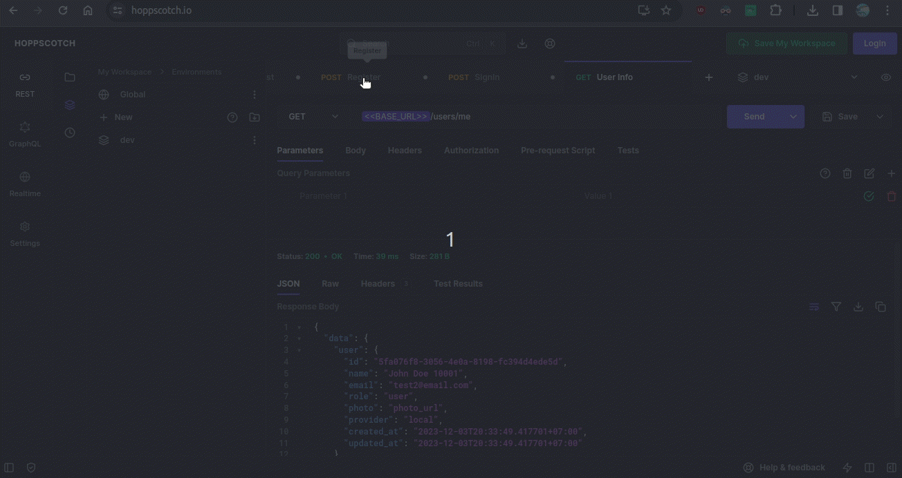

# Simple Blog App

This is a simple blog application built with Go and Gin, a popular web framework. The application includes user authentication, post creation, updating, and deletion. It uses PostgreSQL as its database and JWT for user authentication.

## Installation

To run this application, you need to have Docker installed on your machine. If you don't have Docker installed, you can download it from the [official Docker website](https://www.docker.com/products/docker-desktop).

After installing Docker, you can initialize the application by running the following command:

```bash 
sudo docker run --name basic-postgres --rm -e POSTGRES_USER=postgres -e POSTGRES_PASSWORD=password -e POSTGRES_DB=test -e PGDATA=/var/lib/postgresql/data/pgdata -v /tmp:/var/lib/postgresql/data -p 5432:5432 -it postgres:latest
```


This command will start a PostgreSQL instance with the specified environment variables.

## Environment Variables

Before running the application, make sure to set the following environment variables:

```bash
POSTGRES_HOST=127.0.0.1 POSTGRES_USER=postgres POSTGRES_PASSWORD=password POSTGRES_DB=test POSTGRES_PORT=5432
CLIENT_ORIGIN=http://localhost:8081 PORT=8081
ACCESS_TOKEN_PRIVATE_KEY="" 
ACCESS_TOKEN_PUBLIC_KEY="" 
ACCESS_TOKEN_EXPIRED_IN=15m 
ACCESS_TOKEN_MAXAGE=15
REFRESH_TOKEN_PRIVATE_KEY="" REFRESH_TOKEN_PUBLIC_KEY="" REFRESH_TOKEN_EXPIRED_IN=60m REFRESH_TOKEN_MAXAGE=60
```

You can generate the keys for `ACCESS_TOKEN_PRIVATE_KEY` and `ACCESS_TOKEN_PUBLIC_KEY` using the `initializers/gen.go` file or OpenSSL.

To generate keys using OpenSSL, you can use the following commands:

```bash
openssl genpkey -algorithm RSA -out private_key.pem -pkeyopt rsa_keygen_bits:2048 openssl rsa -pubout -in private_key.pem -out public_key.pem
```

Replace the contents of `ACCESS_TOKEN_PRIVATE_KEY` and `ACCESS_TOKEN_PUBLIC_KEY` with the contents of `private_key.pem` and `public_key.pem` respectively.

You can do the same for `REFRESH_TOKEN_PRIVATE_KEY` and `REFRESH_TOKEN_PUBLIC_KEY`.

## Running the Application

After setting the environment variables and initializing the database, you can run the application using the following command:

```bash
go run main.go
```

The application will start on port 8081. You can access the application by navigating to `http://localhost:8081` in your web browser.

## Testing the API Response using Hoppscotch

Hoppscotch is a free, fast, and beautiful API request builder that lets you test and preview the API response. You can import the `hoppscotch.json` file to Hoppscotch to test the API endpoints of your application.

The `hoppscotch.json` file contains the pre-configured requests for all the API endpoints of your application.

To test the API response using Hoppscotch, follow these steps:

1. Go to [Hoppscotch](https://hoppscotch.io/).
2. Click on the "Import/Export" button in the top right corner.
3. Select "Import from file" from the dropdown menu.
4. Choose the `hoppscotch.json` file from your local system.
5. The requests will be imported into Hoppscotch. You can now test the API endpoints by sending requests and previewing the responses.




## Endpoints

The application provides the following endpoints:

- `POST /signup`: Sign up a new user.
- `POST /signin`: Sign in an existing user.
- `POST /refresh-token`: Refresh the access token.
- `POST /logout`: Log out the current user.
- `GET /me`: Get the current user's details.
- `POST /posts`: Create a new post.
- `PUT /posts/:id`: Update an existing post.
- `GET /posts/:id`: Get a post by its ID.
- `GET /posts`: Get all posts.
- `DELETE /posts/:id`: Delete a post by its ID.